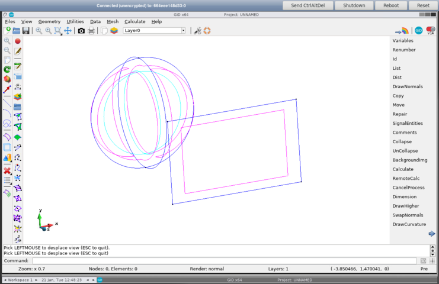

# GiD Unix containers with the latest developer version

## GiD - just GiD inside

Creates the **gid-unix-developer** docker image

## GiD - noVNC

Creates the **gidhome-novnc** docker image

* Change directory to *gid-novnc*
* Build the tocker image with *./dockerBuild-gidhome.sh*
* Run it with *./dockerRun-gidhome.sh*
* Open an Internet browser and connect to *<http://localhost:8083>*
* et voilà !

[(full size image)](images/gidhome-novnc-example.png)
